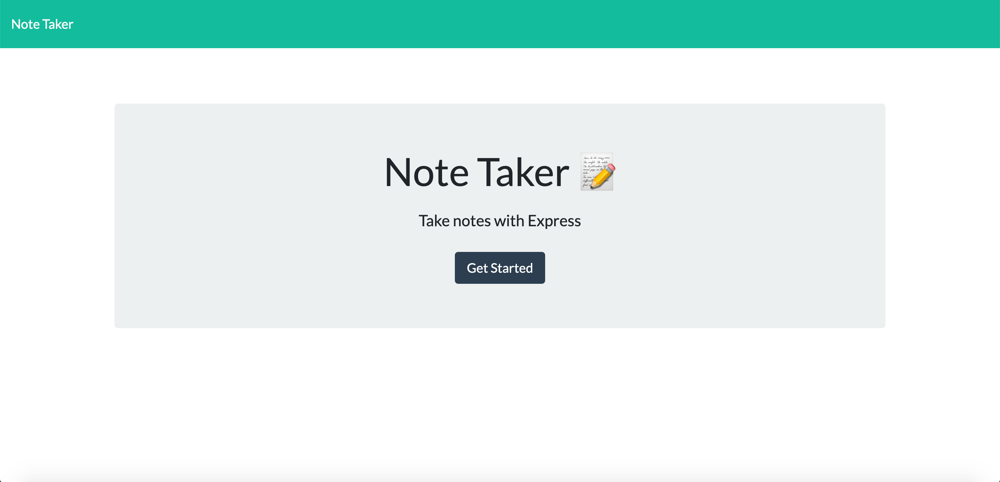
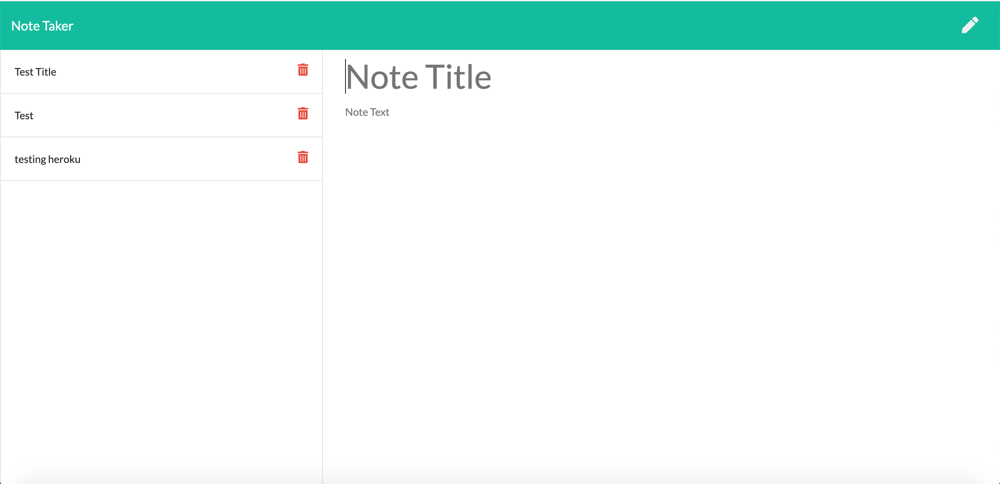

## Note Taker

### Desription

A Note taker app that will allow you to  write, save, and delete notes. 

### Table of Contents
* [Deployed Link](#Deployed-Link)

* [Installation](#Installation)
    
* [Instructions](#Instructions)

  
    ### Deployed Link
    https://young-springs-50574.herokuapp.com/

    ### Installation
     To install necessary dependencies, run the following command:
     * npm i 
    ### Instructions
    To start click"get started". Adding a new note is made simple by clicking the pencil icon in the top right corner, add a title and note then hit the save icon. To delete just simply click on the trash can icon next to the note you wish to delete. 
    
     

